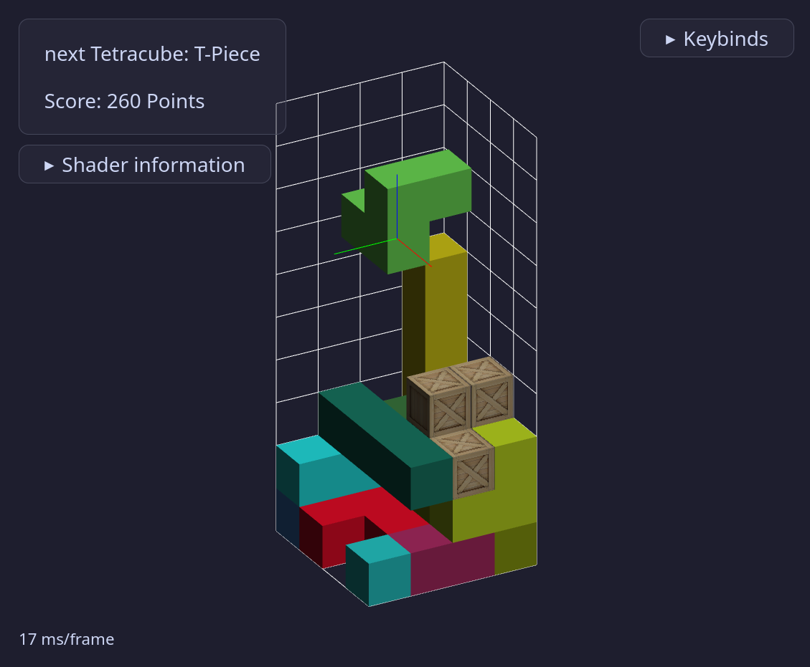

# 3D Tetris

A 3D version of Tetris written in Typescript using WebGl.
This was originally written for the [GFX 25S course of University of Vienna](https://ufind.univie.ac.at/en/course.html?lv=052200&semester=2025S).

You can play the game, by cloning the repo and then compiling and running the site as described in the [Running the site section](#running-the-site).



## Gameplay

The game plays similar to a normal tetris game, with the differences, that there are more pieces (the tetracubes as defined [here](https://www.mathematische-basteleien.de/tetracube.htm)) and you have to fill an entire horizontal 2D slice for the pieces to disappear.
The scoring system uses the original [BPS scoring system](https://tetris.wiki/Scoring) because levels aren't implemented.
Tetracubes can furthermore be rotated around all 3 axes.

There are some other notable features:

- The game can be paused by pressing _p_
- You can display the complete grid (including parts that might obstruct the view) by pressing _g_
- You can switch out the cubes that the tetracubes consist of for cylinders by pressing _f_. This has no use other than showing differences in shaders better
- You can also select some of these options in the start menu, along with the size of the playing field
- Every tetracube has a 1/10 chance of being textured. This has also no practical effect
- A complete list of controls can be found on the site under the `Keybinds` collabsible or in the [Controls](#controls) section

## Controls

### Movement

- _p_: (un)pauses the game
- _->_ or _d_: move the piece in the **positive x** direction
- _<-_ or _a_: move the piece in the **negative x** direction
- _/\\_ or _w_: move the piece in the **negative z** direction
- _\\/_ or _s_: move the piece in the **positie z** direction
- _space_: let the piece fall instantly to the ground

> [!NOTE]
> Movement will always be with respect to the global coordinate system and is NOT view-dependent.
> You can display the global coordinate system with the axis overlay

### Rotation

- _x_: rotate counterclockwise around **x** axis
- _X_: rotate clockwise around **x** axis
- _y_: rotate counterclockwise around **y** axis
- _Y_: rotate clockwise around **y** axis
- _z_: rotate counterclockwise around **z** axis
- _Z_: rotate clockwise around **z** axis

> [!NOTE]
> Rotation will always be with respect to the global coordinate system and is NOT view-dependent.
> You can display the global coordinate system with the axis overlay

### Viewport

- _i_: rotate counterclockwise around **x** axis
- _k_: rotate clockwise around **x** axis
- _j_: rotate counterclockwise around **y** axis
- _l_: rotate clockwise around **y** axis
- _u_: rotate counterclockwise around **z** axis
- _o_: rotate clockwise around **z** axis
- _+_ or _scroll up_: zoom in
- _-_ or _scroll down_: zoom out
- _clicking and dragging mouse_: rotate the viewport around the **y** axis

### Miscellaneous

- _g_: toggle full grid (full grid will show all sides of the grid)
- _v_: toggle orthographic/perspective view
- _f_: switch the used shader between phong and gouraud shading
- _v_: toggle between cubes/cylinders
- _m_: toggle music
- _#_: toggle axis overlay; Axis overlay shows the axes of the coordinate system overlayed over the active piece which makes movement and rotation easier

## Running the site

Install all packages and build the site:

```bash
pnpm install
pnpm run build
```

Then you should be able to run the site by just starting an http server in the `dist` directory:

```bash
cd dist
python -m http.server 8080
# or
cd dist
live-server
```

Ive used primarily the npm live-server 1.2.2 as a webserver, but also tested with the python http.server
I have tested the site with Mozilla Firefox 136.0.3 browser.

## Credit

- As the only external library, I used [gl-matrix](https://glmatrix.net/) for vector and matrix operations

- I used the following ressources for the textures with just minimal alignment changes:
    - [https://stock.adobe.com/at/images/wooden-crate-front-view-cargo-box-texture-3d-rendering/199149984](https://stock.adobe.com/at/images/wooden-crate-front-view-cargo-box-texture-3d-rendering/199149984)
    - [https://www.pinterest.com/pin/89157267620469807/](https://www.pinterest.com/pin/89157267620469807/)

- Music by [https://github.com/rtfmbrah](https://github.com/rtfmbrah)
